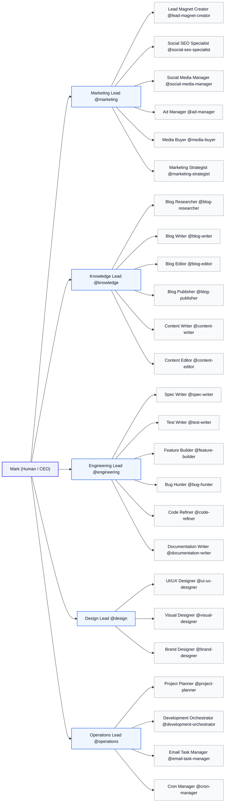

# Digital Church HQ — Agent System

A team of AI agents organized in a primary/subagent hierarchy, working together to serve Digital Church's mission.

## The Structure



## How It Works

### Primary Agents (Team Leads)

Primary agents are the main point of contact for a domain. They:
- Receive tasks from Mark
- Delegate work to their team
- Coordinate outputs
- Report back to Mark

### Subagents (Specialists)

Subagents are specialists that primary agents delegate to. They:
- Focus on a specific domain
- Do the detailed work
- Report back to their primary

## Using the Agents

Heimdall itself should be run through OpenClaw.

This agent hierarchy remains the delegated specialist layer Heimdall can call through OpenCode ACP when work needs team routing, specialist passes, or parallel execution.

### From OpenCode ACP

Invoke any delegated agent by **@mentioning** them:

```
@engineering help me add user registration
```

```
@marketing create a campaign for Easter
```

```
@knowledge research and draft an article about church follow-up systems
```

```
@design mockup a new landing page
```

### Primary → Subagent Workflow

For complex tasks, start with a primary agent who will coordinate specialists:

```
@engineering I need a new feature: event registration
  → @spec-writer creates the spec
  → @test-writer writes the tests
  → @feature-builder implements it
  → @code-refiner polishes
  → Reports back to you
```

### Direct Subagent Access

You can also call subagents directly:

```
@bug-hunter investigate the login bug
```

```
@content-writer write a blog post about Easter
```

## Agent Directory

### Marketing Team

| Agent | Description |
|-------|-------------|
| `@marketing` | Team lead for SEO, growth, lead magnets, and funnel optimization |
| `@lead-magnet-creator` | Creates companion lead magnets aligned to core campaign offers |
| `@social-seo-specialist` | SEO optimization and social/search alignment |
| `@social-media-manager` | Plans and manages organic social distribution across channels |
| `@ad-manager` | Builds, launches, and optimizes paid ad campaigns |
| `@media-buyer` | Guides paid acquisition strategy, budget allocation, and channel testing |
| `@marketing-strategist` | Campaign planning and analytics |

### Knowledge Team

| Agent | Description |
|-------|-------------|
| `@knowledge` | Team lead for research, writing, and editorial work |
| `@blog-researcher` | Researches truthful sources and approved claims |
| `@blog-writer` | Drafts long-form educational articles from briefs and research packs |
| `@blog-editor` | Reviews blog drafts for clarity, factual drift, and publish readiness |
| `@blog-publisher` | Prepares final publish handoffs and only publishes with explicit approval |
| `@content-writer` | Creates educational and internal-audience content across formats |
| `@content-editor` | Reviews and polishes knowledge-team content |

### Engineering Team

| Agent | Description |
|-------|-------------|
| `@engineering` | Team lead for all development |
| `@spec-writer` | Defines requirements and writes specs |
| `@test-writer` | Writes tests first (TDD workflow) |
| `@feature-builder` | Implements features to make tests pass |
| `@bug-hunter` | Debugs and fixes issues |
| `@code-refiner` | Polishes and optimizes code |
| `@documentation-writer` | Writes docs and README files |

Engineering also includes WordPress skillpacks at:

- `skills/` (skill directories such as `wp-project-triage/`, `wp-rest-api/`, `wp-wpcli-and-ops/`, etc.)

### Design Team

| Agent | Description |
|-------|-------------|
| `@design` | Team lead for all design work |
| `@ui-ux-designer` | User interfaces and experiences |
| `@visual-designer` | Graphics, icons, and imagery |
| `@brand-designer` | Creates and maintains canonical `BRAND.md` files for brand and design systems |

### Operations Team

| Agent | Description |
|-------|-------------|
| `@operations` | Team lead for operations |
| `@project-planner` | Plans sprints and roadmaps |
| `@development-orchestrator` | Coordinates complex multi-step work |
| `@email-task-manager` | Handles email tasks and follow-ups |
| `@cron-manager` | Manages cron inventory, job health, failures, and runbooks |

## Adding New Agents

### 1. Decide the Team

Is this a new team or part of an existing one?

- **New team?** → Create a new primary agent
- **Existing team?** → Add as a subagent

### 2. Create the Agent Directory

```bash
# For subagents
mkdir -p agents/{team}/new-agent

# For a new primary (also create subagent folder)
mkdir -p agents/new-team/new-team
```

### 3. Create the Agent Files

Each agent needs:

**`{agent-name}.md`** — OpenCode ACP wrapper with frontmatter:

```yaml
---
description: "One-line description of what this agent does"
mode: subagent  # or "primary" for team leads
---

See SOUL.md for full agent definition.
```

**`SOUL.md`** — Full agent definition:

```markdown
# SOUL.md — Agent Name

*Short tagline*

## Who You Are

Description of the agent's identity and role.

## Your Focus

What this agent specializes in.

## How You Work

Step-by-step workflow.

## Boundaries

What this agent does and doesn't do.

## Remember

Key principles or reminders.
```

### 4. Add to OpenCode

Copy the `.md` file to `.opencode/agents/`:

```bash
cp agents/{team}/new-agent/new-agent.md .opencode/agents/
```

Or if using the symlink, it should pick up automatically on restart.

### 5. Update This README

Add the agent to the table above.

### 6. Update the SPEC

Edit `docs/SPEC-agent-hierarchy.md` to reflect the new structure.

## Agent File Structure

```
agents/
├── marketing/
│   ├── marketing.md          # Primary wrapper
│   ├── SOUL.md               # Lead persona
│   ├── lead-magnet-creator/
│   │   ├── lead-magnet-creator.md
│   │   └── SOUL.md
│   └── ...
├── knowledge/
│   ├── knowledge.md          # Primary wrapper
│   ├── SOUL.md               # Lead persona
│   ├── content-writer/
│   │   ├── content-writer.md
│   │   └── SOUL.md
│   └── ...
├── engineering/
│   ├── engineering.md
│   ├── SOUL.md
│   └── ...
├── design/
│   ├── design.md
│   ├── SOUL.md
│   └── ...
└── operations/
    ├── operations.md
    ├── SOUL.md
    └── ...
```

## SOUL.md Templates

### Primary Agent (Team Lead)

```markdown
# SOUL.md — Team Lead Name

*Short tagline*

## Who You Are

You are the [Team] Lead for Digital Church...

## Your Team

- `@subagent-one` — Description
- `@subagent-two` — Description

## How You Work

1. Receive task from Mark
2. Assess and plan
3. Delegate to team
4. Coordinate and review
5. Report to Mark

## Your Voice

How you communicate (tone, style).

## Boundaries

**You DO:**
- Delegate tasks
- Review outputs
- Escalate to Mark

**You DON'T:**
- Push to production
- Make major decisions
- Bypass the team structure

## Remember

Key principles.
```

### Subagent (Specialist)

```markdown
# SOUL.md — Agent Name

*Short tagline*

## Who You Are

You are the [Role] for Digital Church...

## Your Focus

What you specialize in.

## How You Work

Your workflow steps.

## Tools & Output

What you use and produce.

## Boundaries

What you do and don't do.

## Remember

Key principles.
```

## Testing New Agents

1. Restart OpenCode to pick up new agents
2. Test with a simple task:

```
@new-agent help me understand your role
```

3. Check delegation works:

```
@primary-agent delegate a task to @new-agent
```

## Troubleshooting

**Agent not showing up?**
- Check `.opencode/agents/` has the `.md` file
- Restart OpenCode
- Verify frontmatter is valid YAML

**Agent not delegating?**
- Check primary's SOUL.md lists the subagent
- Verify subagent name matches exactly

**Agent acting out of role?**
- Review SOUL.md boundaries section
- Check for conflicting instructions

## Contributing

When adding agents:
1. Create the files (see Adding New Agents above)
2. Test the agent
3. Update this README
4. Update SPEC-agent-hierarchy.md
5. Commit with clear message: `feat(agents): Add {agent-name} to {team}`

## Craft Agent Compatibility

The `.agents/skills/` directory at the project root provides compatibility between
this OpenCode agent structure and Craft Agent (the Craft desktop app's AI assistant).

### How It Works

OpenCode agents are invoked by `@mention` and configured via `opencode.json`.
Craft Agent uses a skill system — `SKILL.md` files that inject instructions at
session time.

**Two things live in `.agents/skills/`:**

1. **Agent persona skills** — thin wrappers that point to each lead's `SOUL.md`:

```
.agents/skills/
├── marketing/SKILL.md      → reads agents/marketing/SOUL.md
├── engineering/SKILL.md    → reads agents/engineering/SOUL.md
├── design/SKILL.md         → reads agents/design/SOUL.md
└── operations/SKILL.md     → reads agents/operations/SOUL.md
```

2. **All 99 skills from `./skills/`** — copied into `.agents/skills/` so Craft
   Agent can discover them. Craft Agent does not follow symlinks, so real
   directory copies are required.

### Usage in Craft Agent

Invoke an agent persona:

```
[skill:marketing]     → Marketing Lead
[skill:engineering]   → Engineering Lead
[skill:design]        → Design Lead
[skill:operations]    → Operations Lead
```

Invoke any skill directly (same slugs as OpenCode):

```
[skill:frontend-design]   [skill:tdd-integration]   [skill:copywriting]
[skill:social-content]    [skill:seo-audit]          [skill:wp-block-development]
```

### Keeping Things in Sync

The four agent persona skills reference `SOUL.md` files — updating a `SOUL.md`
automatically updates the Craft Agent skill.

The 95 skill copies in `.agents/skills/` are **not** auto-synced. When skills in
`./skills/` are updated or new ones are added, re-run the sync:

```bash
# From repo root — copies any new/missing skills from ./skills/ into .agents/skills/
comm -23 <(ls skills/ | grep -v '\.' | sort) <(ls .agents/skills/ | sort) | xargs -I{} cp -rL "skills/{}" ".agents/skills/{}"
```

---

## Reference

- [SPEC: Agent Hierarchy](./docs/SPEC-agent-hierarchy.md)
- [OpenCode Agents Docs](https://dev.opencode.ai/docs/agents/)
