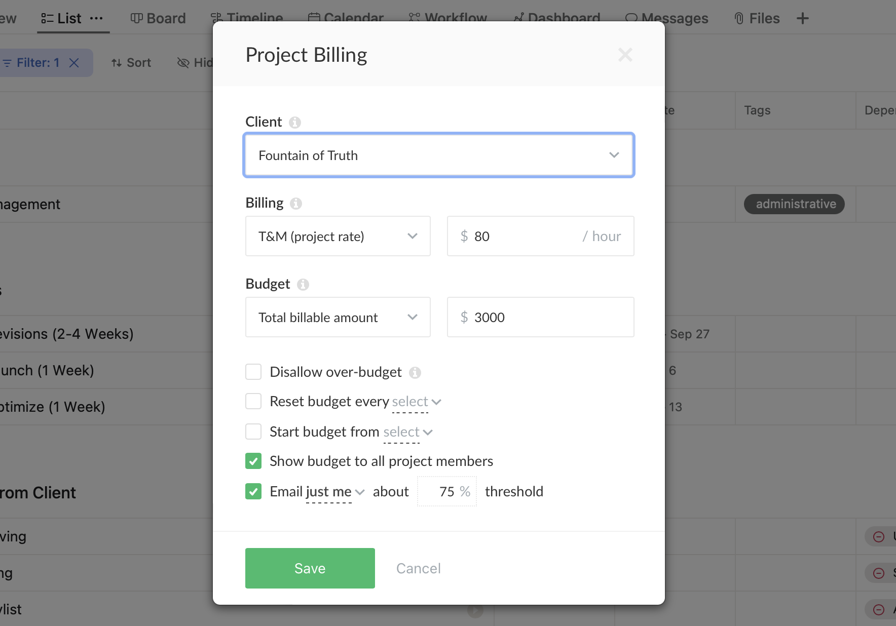

# Setting up the Project Budget in Everhour

1. Set Billing Type to **Time & Money Project Rate** `T&M (project rate)`.
2. Set Budget to Total Billable Amount according to the project proposal. `(e.g. $3,000)`.
3. Set the following checkboxes as checked:
    - [x] **Show Budget to all Project Members.**
    - [x] **Email `just me` about `75%` threshhold.**
