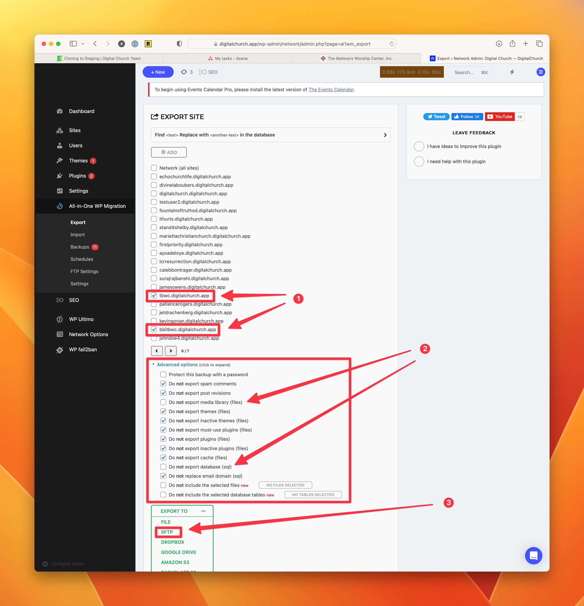

# Cloning a Site to Staging Environment

When we need to import content from an outside source, like sermons or events from an old client site, we sometimes need to clone a site over to our development server for use as a staging environment. This ensures that we don't risk losing the website we've been building if something were to go wrong. This is good practice any time we plan to manipulate the database.

## Export from Production to Development

We use All-in-One WP Migration to export our sites to staging.

:::danger Danger Zone
Make sure you follow these instructions carefully. Whenever we use All-in-One WP Migration, it's **vitally important** that we **only export the media library and database**. All other options should be selected as "Do **not** export..."
:::

1. In the network admin, go to All-in-One Migration > Export and find the subsite you need to export.
2. IMPORTANT: Open the Advanced Options dropdown menu and make sure that ONLY the database and media library are being exported. If plugins, themes, or other options are left alone, we risk major issues.
3. Once you have made certain the correct options are selected, open the Export To options and select SFTP.

## Import into Staging

Once the export completes, the site backup should be available on the All-in-One Backups section in the Network Admin at digitalchurch.dev. Find the correct file and choose to restore it.

On the next screen, choose the option to **Proceed >**

Continue through each subsite, changing the subdomain if necessary (It usually isn't, but keep in mind that it will overwrite that subdomain if it is in use.)

When the import is done, you'll receive a message that is has been imported successfully. Click **Finish >**.

Visit the subsite to see the results.