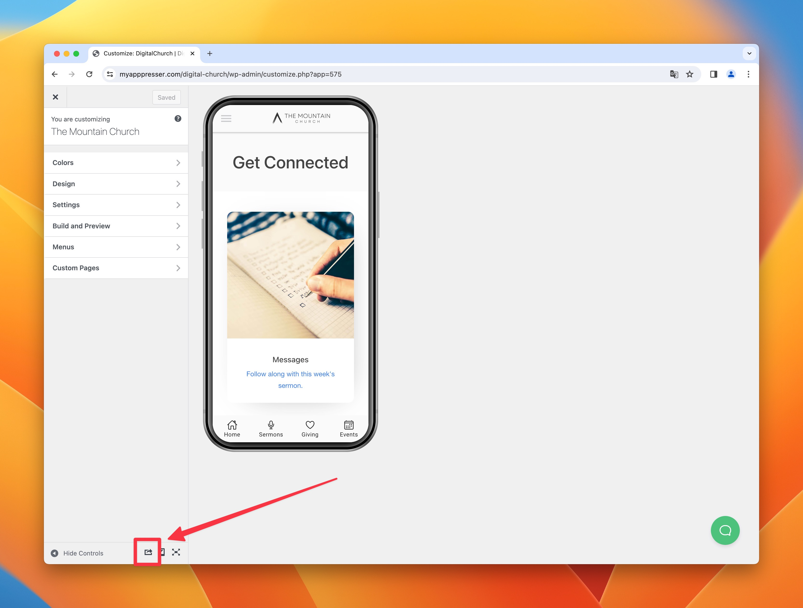

# App Store Screenshots

We are going to create screenshots of the following device types:

1. iPhone 6.5" Display (428 x 926 @3x)
2. iPhone 6.7" Display (430 x 932 @3x)
3. iPhone 5.5" Display (414 x 736 @3x)
4. iPad Pro 12.9" Display (2048 x 2732)


Reference: [https://developer.apple.com/help/app-store-connect/reference/screenshot-specifications](https://developer.apple.com/help/app-store-connect/reference/screenshot-specifications)

## Set up Google Chrome

An easy way to generate screenshots using the Google Chrome device emulator. You will need to add 2 new device sizes to the emulator to get the necessary sizes.

#### 1. Open the developer tools: *View > Developer > Developer Tools* `CMD+OPT+i`


#### 2. If you are not already in responsive device mode, you may need to click the device icon at the top left of the developer tools window.


#### 3. If you don't already have iPhone XS Max as an option, click the dropdown, then edit


#### 4. Click "Add custom device," then enter the options pictured, then save. The iPhone XS Max will generate the 6.5 inch


## Export Screenshots

#### 1. Go to the app customizer for the app you are submitting, click the little share icon at the bottom. You should get a url like this:

```
https://myapppresser.com/digital-church/wp-content/uploads/sites/3407/apps/493/www/
```



#### 2. Copy the url into a new tab Chrome to see the app full screen.

:::note
If you see a 403 error, add /index.html to the end of the url you copied.
:::

#### 3. Open the developer tools: *View > Developer > Developer Tools* `CMD+OPT+i`


#### 4. If you are not already in responsive device mode, you may need to click the device icon at the top left of the developer tools window.


:::note
If you don't already have iPhone XS Max as an option, see the section above "Setting Up Google Chrome"
:::

#### 5. Export Screenshots for each device size needed.


Use the dropdown to select each size. Then use the three dots menu at the top right corner of the responsive view window to *Capture Screenshot* for each page needed. Use each of the bottom tabs except Giving (if that is one of them).

1. iPhone 6.5" Display (428 x 926 @3x)
2. iPhone 14 Pro Max 6.7" Display (430 x 932 @3x)
3. iPhone 6/7/8 Plus 5.5" Display (414 x 736 @3x)
4. iPad Pro 12.9" Display (1024 x 1366 @2x)

After grabbing your screenshots, you may want to add device frames and text to the screenshots make your app store listing look great. Read [this article](https://apppresser.com/app-store-screenshots/) for help with that.

## Import Screenshots into Figma

Drag each screenshot into the Figma project for this client. Once all screenshot images are added, export all layers to the Client App Assets folder as PNG files.

## Upload Screenshots to App Store Listing

Upload each screen to the app store listing in the appropriate area.