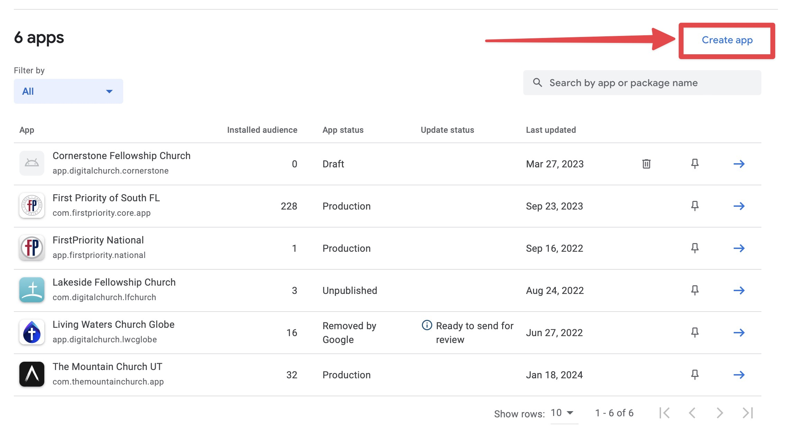
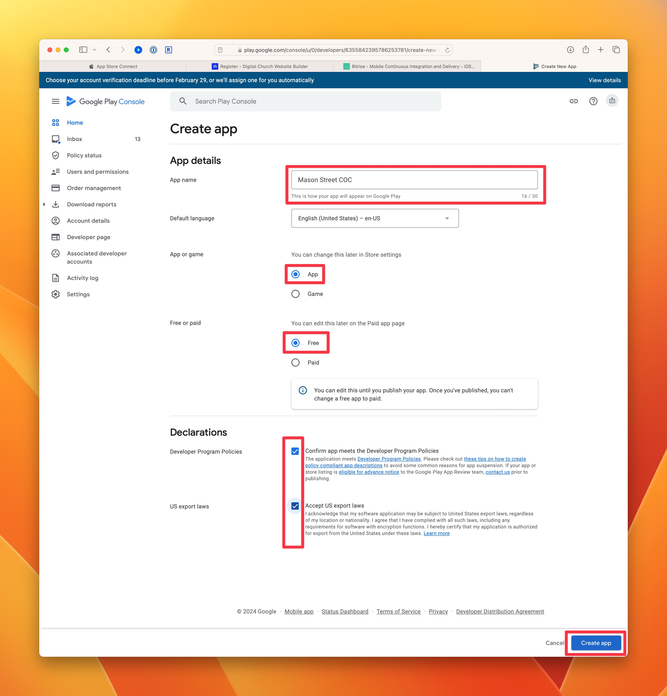
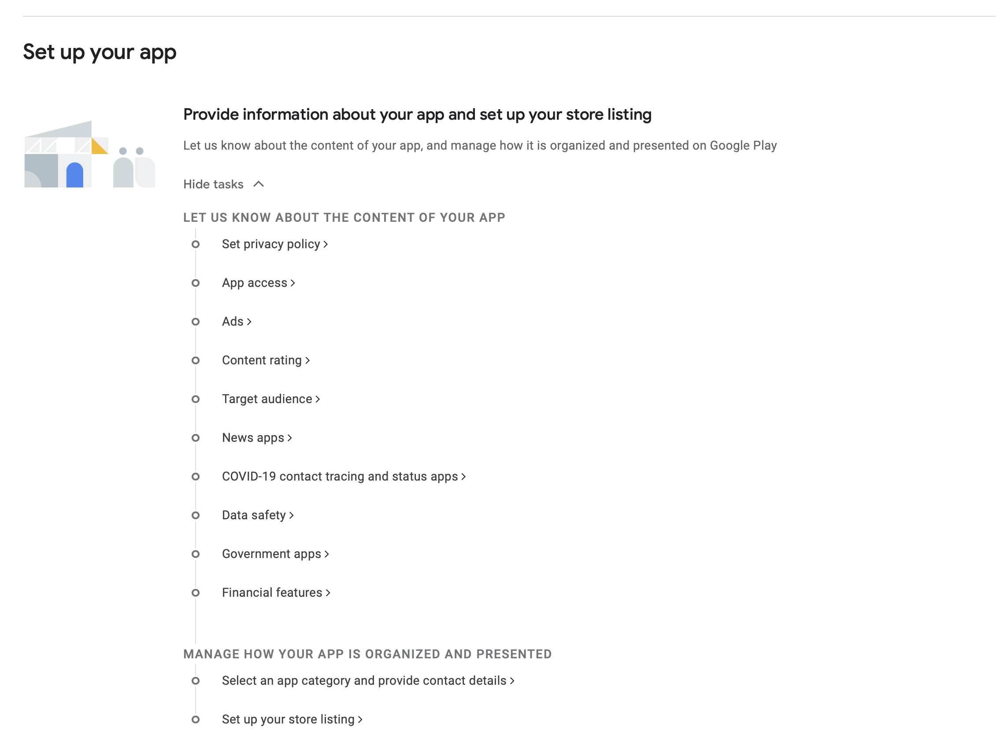
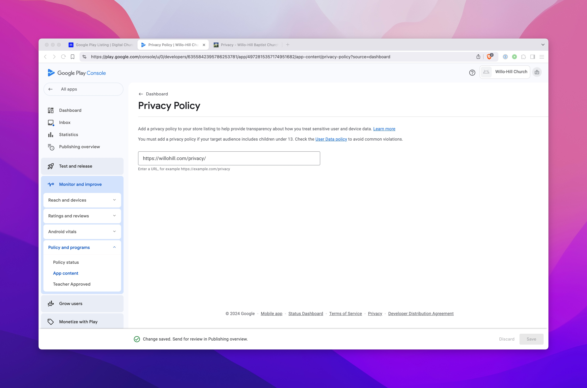
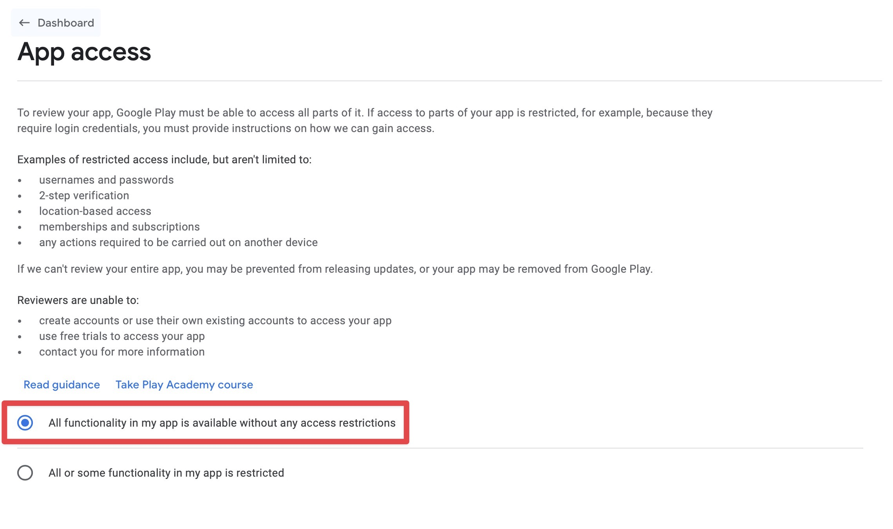
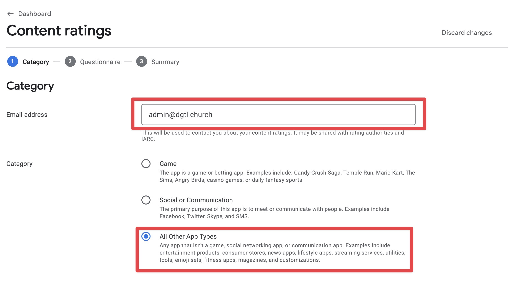

# Google Play Listing

import ReactPlayer from 'react-player';

<ReactPlayer url="https://www.youtube.com/watch?v=5VemUt2rx_c"
    width="100%"
    height="100%"
    controls={true}
    playing={true}
    muted={true}
     />

## Getting started

Log into the [Google Play Console](https://play.google.com/apps/publish) and create a new app.

## Setup your app

In the dashboard for the specific app, go through the checklist for "Set up your app"

### 1. Privacy Policy

(example: https://mountainchurch.digitalchurch.app/privacy/)

### 2. App Access

**Select:** All functionality in my app is available without any access restrictions

Unless we are setting up login through the app, then select the other option and provide login credentials.

### 3. Ads

**Select:**  No, my app does not contain ads

### 4. Content Rating

Select **Start questionnaire**

Email Address: admin@dgtl.church

Category: All Other App Types

#### Downloaded App

Does the app contain any ratings-relevant content (e.g., sex, violence, language) downloaded as part of the app package (code, assets)? **No**

#### User Content Sharing

Does the app natively allow users to interact or exchange content with other users through voice communication, text, or sharing images or audio? **No**

#### Online Content

Does the app feature or promote content that isn't part of the initial app download, but can be accessed from the app? Examples of this type of content are movies in the Netflix app, product listings in the Amazon Shopping app, songs in the Spotify app, or news articles in the New York Times app. **No**

#### Promotion or Sale of Age-Restricted Products or Activities

Does the app focus on promoting or selling items or activities that are typically age-restricted such as cigarettes, alcohol, firearms, or gambling? **No**

#### Miscellaneous

Does the app share the user's current and precise physical location with other users? **No**

Does the app allow users to purchase digital goods? **No**

Is the app a web browser or search engine? **No**

Is the app primarily a news or educational product? **No**

#### Summary

Ratings should be lowest possible. North America: E for Everyone

Press **Save** and return to Dashboard via the sidebar.

### 5. Target Audience

#### Target Age

Select: 18 and over

#### Store Presence

Could your store listing unintentionally appeal to children?

Select: **No**

#### Here's what youve told us.

**Target age**
The target age group for your app is: 18 and over

**Store presence**
Your app doesn't appeal to children. If Google disagrees with your answer, you won't be able to update the app. If this happens, there are a number of ways you can resolve it.

Press **Save** and return to Dashboard via the sidebar.

### 6. News apps

Is your app a news app?

Select: **No**

Press **Save** and return to Dashboard via the sidebar.

### 7. COVID-19 contact tracing and status apps

To help us understand whether your app is a COVID-19 contact tracing or status app, select all of the statements below that apply to your app.

**Select the last answer only:** My app is not a publicly available COVID-19 contact tracing or status app

Press **Save** and return to Dashboard via the sidebar.

### 8. Data safety

Press **Next**

#### Data collection and security.

Does your app collect or share any of the required user data types?

Select: **No**

#### Store listing preview

Press **Save** and return to Dashboard via the sidebar.

### 9. Government apps

Is your app developed by or on behalf of a government? For example, a national health, city parking, or state licensing app.

Select: **No**

Press **Save** and return to Dashboard via the sidebar.

### 10. Financial features

#### Financial features in your app

Select all of the financial features your app provides. This helps us to make sure the right teams review your submission.

**Select only the last option:** My app doesn't provide any financial features

Press **Next**

Press **Save** and return to Dashboard via the sidebar.

### 11. Select an app category and provide contact details

#### App Category

App or Game: **App**

Category: **Lifestyle**

#### Store listing contact details

Email Address: admin@dgtl.church

Leve the other two fields (Phone number and website) blank.

Press **Save** and return to Dashboard via the sidebar.

### 12. Set up your store listing

#### Listing assets

**App Name** should already be filled out.

**Short Description:**
Access sermons, groups, events and more from Client Church.

**Full description:**
Example: Watch sermons from The Mountain Church, check out available small groups, watch live services, and stay connected to the latest events at The Mountain Church in Sandy, UT.

#### Graphics

App icon & Feature graphic should be in the client dropbox folder. If not, export it from the client Figma project.

Use the iPhone 6.5 Inch Screenshots for Android Phone.

Use the iPad screenshots for both 7" and 10" tablets.

## Start Testing Now

In the dashboard for the app, go through the checklists for "Start Testing Now".

### Select Testers

Select the Internal Testing group.