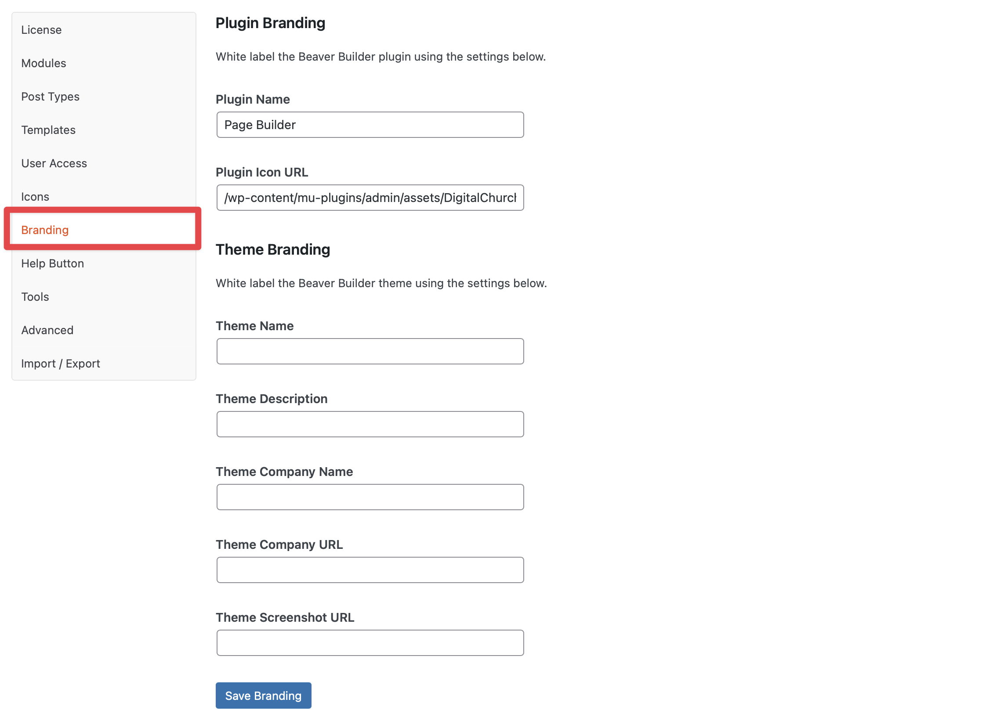

# Title

We use Beaver Builder as our page builder, but we white label it as our own. In order to do this, there should be two settings in the admin area that are set as outlined below.



### 1. Plugin Name

```
Page Builder
```

### 2. Plugin Icon URL

```
/wp-content/mu-plugins/admin/assets/DigitalChurchFavicon.svg
```